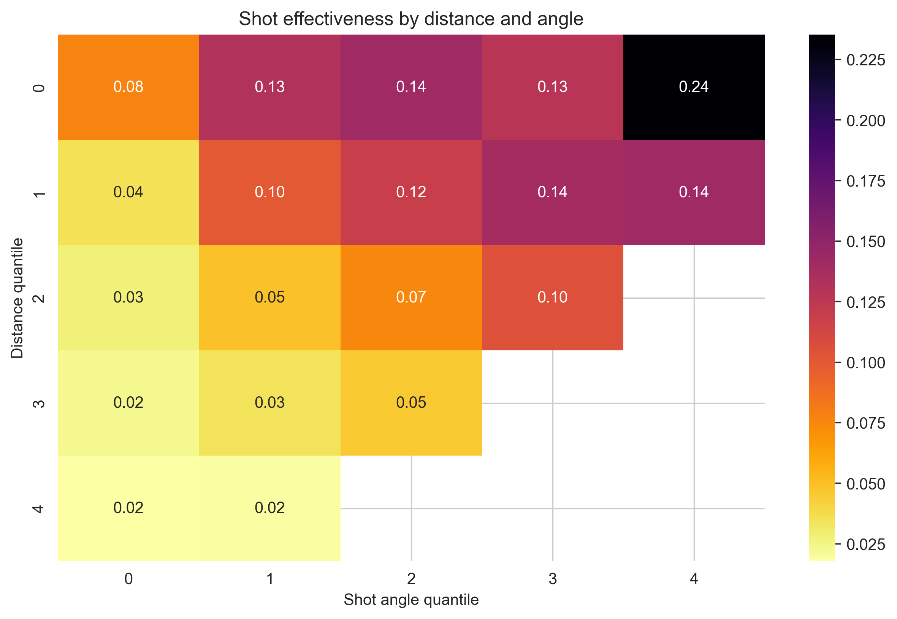
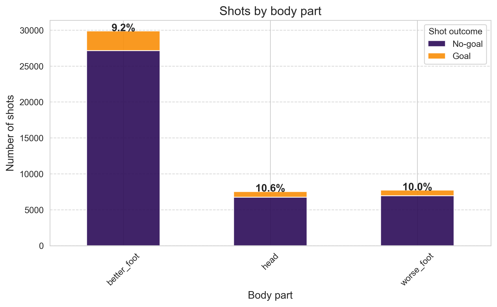
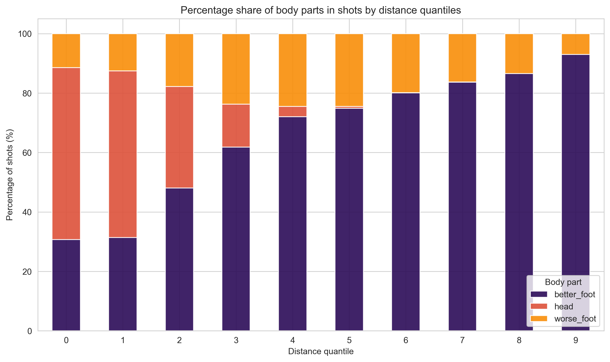
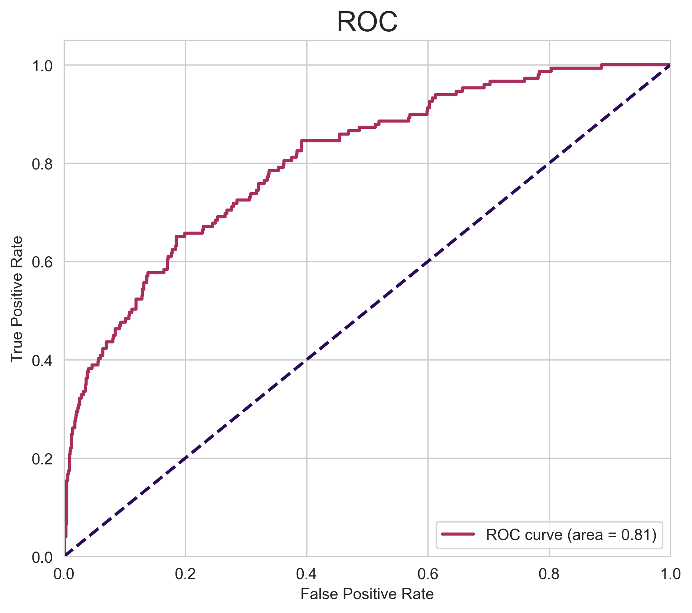
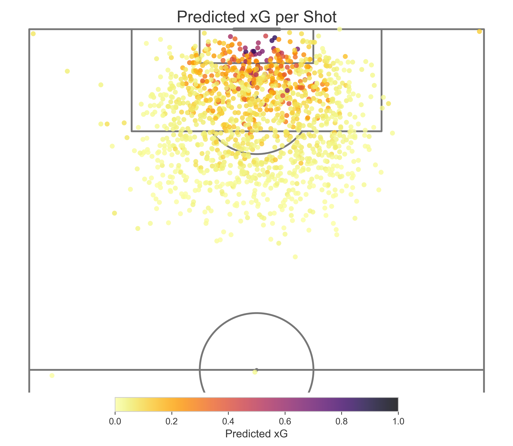
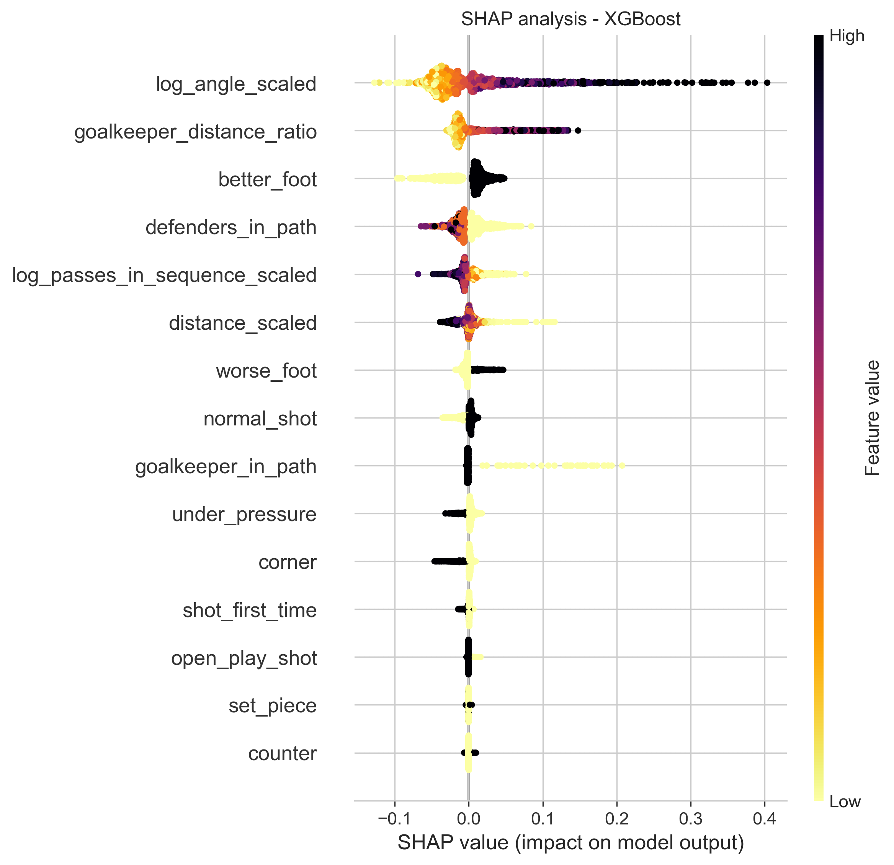

# ⚽ Football Expected Goals (xG) Predictor

## 🧠 About the Project

An Expected Goals (xG) model that predicts the probability of scoring based on StatsBomb open data. The project trains and compares Logistic Regression, Random Forest, and XGBoost using Hyperopt hyperparameter tuning with 4-fold stratified cross-validation. Models are evaluated on a true out-of-sample holdout — the FIFA World Cup 2022 dataset. Raw probabilities are well-calibrated; Beta, Isotonic, and Platt calibration methods are compared as a verification step.

## 🎯 Motivation

Expected Goals (xG) is one of the most important metrics in modern football analytics. It allows for evaluating shot quality regardless of whether the shot resulted in a goal. In this project, I built my own xG model to better understand factors affecting shot effectiveness and create a tool that can be used for match analysis and player evaluation.

## 📋 Data

**Training & calibration**: StatsBomb open dataset, 2015/16 season, five top European leagues:
- Premier League (England)
- La Liga (Spain)
- Bundesliga (Germany)
- Serie A (Italy)
- Ligue 1 (France)

**Test holdout**: FIFA World Cup 2022 — collected separately, never seen during training or calibration.

The data contains detailed information about each shot: position on the pitch, shot type, freeze-frame data (goalkeeper and defender positions), play pattern, and pass sequence context.

**Note**: Data files are not included in the repository. Collect them by running:

```bash
python src/data_collector.py                          # 2015/16 club data
python src/data_collector.py --fifa-2022 --skip-club  # FIFA 2022 test holdout
```

Source: https://github.com/statsbomb/open-data

## 🔍 Methodology

### Data Split

| Set | Source | Size | Purpose |
|---|---|---|---|
| Train | 2015/16 club data | 80% | Hyperopt + 4-fold CV tuning |
| Calibration | 2015/16 club data | 20% | Fit calibration methods |
| Test | FIFA World Cup 2022 | all | True out-of-sample evaluation |

### Feature Engineering (15 features)

- **Geometric**: shot angle (log-transformed), distance from goal
- **Freeze-frame**: defenders in shot path (capped at 3), goalkeeper in path, goalkeeper distance ratio
- **Technical**: dominant/non-dominant foot, header, first-time shot
- **Contextual**: under pressure, passes in sequence (log-transformed)
- **Situational**: play pattern groups — corner, set piece, counter, open play

### Modeling

Three algorithms trained with **Hyperopt** (TPE) and **4-fold stratified CV** as the objective:
1. Logistic Regression
2. Random Forest
3. XGBoost

### Model Calibration

Beta, Isotonic, and Platt calibration methods are fitted on the calibration set and compared by Brier Score and ECE. Raw probabilities are already well-calibrated — calibration is a verification step rather than a critical correction.

## 📊 EDA Highlights

**Shot success heatmap** — higher goal probability in the central zone close to goal:



**Goal rate by body part** — at first glance, headers and non-dominant foot shots seem to outperform dominant foot shots:



**Breaking it down by distance** reveals the true picture — and a great example of why domain knowledge matters:



## 📈 Key Results

Cross-validation on 2015/16 club data (4-fold stratified):

| Model | CV ROC AUC | CV ROC AUC std |
|---|---|---|
| Logistic Regression | 0.8065 | 0.0043 |
| Random Forest | 0.8094 | 0.0054 |
| **XGBoost** | **0.8134** | **0.0040** |

FIFA World Cup 2022 test set — XGBoost (raw probabilities, true out-of-sample):

| Metric | Value |
|---|---|
| ROC AUC | 0.8051 |
| Brier Score | 0.0765 |
| ECE | 0.0178 |
| xG / Goals | 0.9162 |

**ROC Curve:**



**Predicted xG per shot on the pitch** (FIFA World Cup 2022, XGBoost):



### Feature Importance (SHAP)



### Key Findings
1. **Shot geometry** is crucial — shot angle and distance from goal are the strongest predictors
2. **Defenders on shot line** — each additional defender significantly decreases goal-scoring probability
3. **First-time shots** have higher effectiveness than those preceded by ball control
4. **Raw probabilities are well-calibrated** — Beta calibration provides only marginal improvement

## 💻 Technologies

- **Language**: Python 3.7+
- **Data Analysis**: Pandas, NumPy, SciPy
- **ML Models**: Scikit-learn, XGBoost
- **Hyperparameter Tuning**: Hyperopt (TPE)
- **Explainability**: SHAP
- **Visualization**: Matplotlib, Seaborn, Mplsoccer
- **Data Source**: StatsBombPy

## 📁 Project Structure

```
Football-xG-Predictor/
├── notebooks/
│   └── xg_model.ipynb             # Main pipeline: EDA → features → training → evaluation
├── src/
│   ├── data_collector.py          # StatsBomb data collection (CLI)
│   ├── data_processing.py         # load_data, clean_data, select_features
│   ├── feature_engineering.py     # Geometry, freeze-frame, body part, play pattern transforms
│   ├── models.py                  # train_logistic_regression/random_forest/xgboost + CV objective
│   ├── evaluation.py              # evaluate_model + calibrate_best_model
│   └── visualization.py           # All plot helpers
├── assets/
│   ├── eda/                       # EDA visualizations
│   └── models/
│       └── xgboost/               # Model plots (ROC, calibration, SHAP, xG scatter)
├── data/                          # Not in repo — run src/data_collector.py first
├── requirements.txt
└── README.md
```

## 🚀 How to Run the Project

1. Clone the repository:
```bash
git clone https://github.com/bsobkowicz1096/Football-xG-Predictor.git
cd Football-xG-Predictor
```

2. Create a virtual environment (optional but recommended):
```bash
python -m venv venv
source venv/bin/activate  # Linux/macOS
venv\Scripts\activate     # Windows
```

3. Install dependencies:
```bash
pip install -r requirements.txt
```

4. Collect data:
```bash
python src/data_collector.py
python src/data_collector.py --fifa-2022 --skip-club
```

5. Run the notebook:
```bash
jupyter notebook notebooks/xg_model.ipynb
```

Note: The project uses publicly available StatsBomb data, used in accordance with their license terms.
